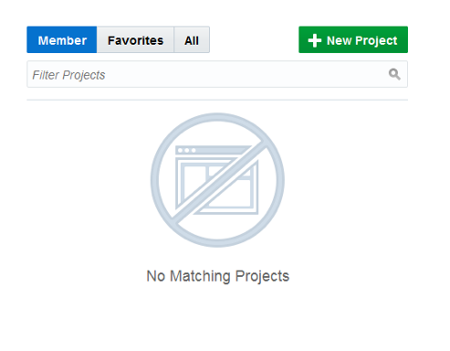
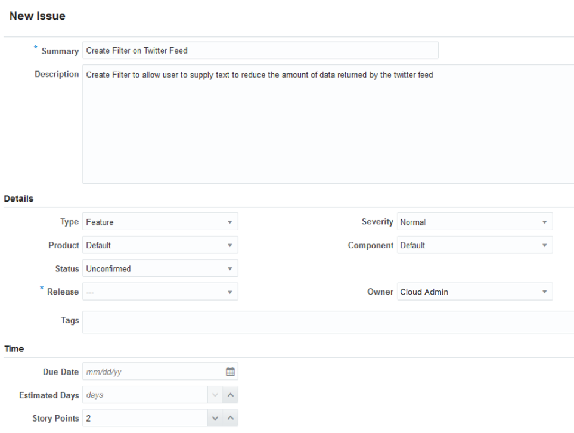
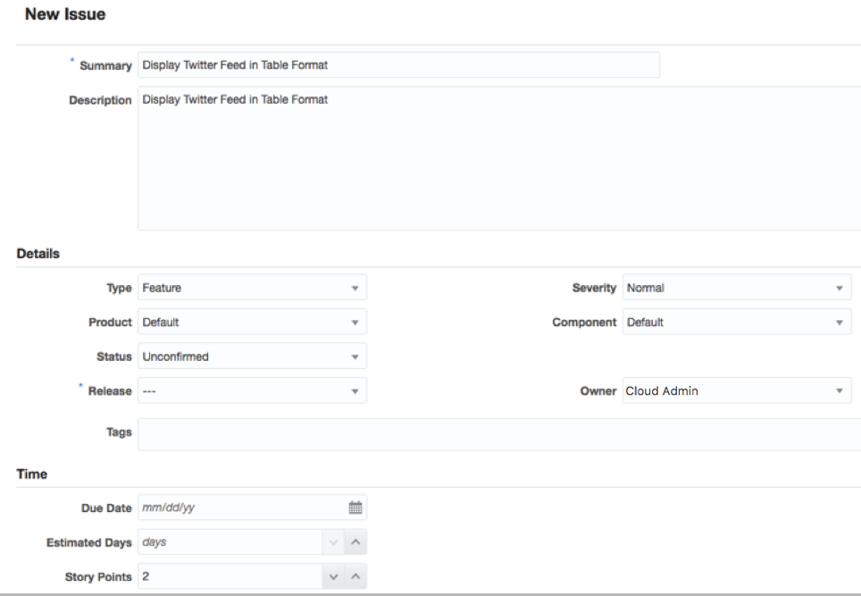

  
Updated: November 6, 2018

## Introduction

This is the first of several labs that will show how to integrate different kinds of databases with VBCS. It will lead you through customizing your Web App, creating different kinds of databases, and finally, connecting them with your web page.

This lab will start with creating your first Web App in VBCS. 

**_To log issues_**, click here to go to the [github oracle](https://github.com/oracle/learning-library/issues/new) repository issue submission form.

## Objectives
- Create Initial Project
    - Add Users to Project
- Create Product Issues
    - Create Issues for Twitter Feed Microservice
    - Create Issues for Twitter Feed Marketing UI
- Create Agile Board and initial Sprint
- Add Issues to Sprint

## Required Artifacts
- The following lab requires an Oracle Public Cloud account; you can sign up for a trial account [here](https://cloud.oracle.com/tryit). 

<details>
  <summary>1. Create The Web App</summary>

  <h3> Create Web App </h3> 

  Sign in to your Cloud Account. <br>
   <br>
   <br>
  <br>

  Navigate to Cloud Dashboard, then open the Visual Builder Service Console. If Visual Builder is not visible, click `Customize Dashboard`, then scroll to Visual Builder in the list and hit `Show`.<br>

   <br> <br>

  At the top right of the page, hit "Quick Starts". This will allow us to create the underlying infrastructure for VBCS at the same time that we create the VBCS instance rather than making them separately. Simply name the instance and then hit `Create`. If you don't care about configuring the database that your instance will run on, this is the way to go. 

  Alternatively, you can hit the `Customize` button on the top right. This would allow you to configure the database that is created. For the purpose of this lab, we'll stick to the default QuickStart configuration.

  <br><br>

  Next, download the generated SSH key and credentials in order to continue, which will allow you to access your instance.

  <br><br>
  <br>

  Your instance will take some time to provision. When it's ready, open the Visual Builder Home page.

  <br><br>
  <br>

  Now, we need to create a Visual Application. From the home page, hit `New` in the top right. 

  <br><br>
  <br>

  Name the application whatever you like; the Description is optional. 

  <br><br>
  <br>

  Your new Application should open automatically. On the left, hit the computer icon for `Web Apps`, then the plus sign to create a new Web App. Name it, then hit `Create`. 

  <br><br>
  <br>

  A blank page will open in the center, with a Components Bar to the left and a Customization Bar on the right.<br>
  
  <br>
  <br>
</details>

<details>
  <summary>2. Customize Web App</summary>
  
  <h3>Customize Web App </h3>
  
  Click on the `Design` view tab in the top right. Drag on an image component into the very top left corner of the page.<br>
  Click on it, then look on the right side go to the Data tab. Put in `https://png.icons8.com/color/1600/reflector-bulb.png` 
  for the source url. This image will act as our website's logo.<br> 
  
  As it is, the image size is bigger than what we'd expect for our logo, so let's resize it. 
  
  <br><br><br>
  
  Go to the `General` tab and set the `width` property to 150. Now that the image is resized, it looks much more fitting to be   our website's logo.<br>
  
  <br>
  <br>
  
  Next, drag on a `Heading` component one column to the right of the logo. Under the `General` tab inside the `Text` field,   
  enter whatever name you'd like your website to be called.<br>
  
  In the row below, drag over a tab bar. The tab bar defaults to three tabs, but we only need two for now. Hover over `Tab 3`   in the General tab, then hit the trash can icon. Rename the tabs `Home` and `Second Page`.<br>
  
  <br>
  <br>
  
  Drag and drop another Heading component, and fill in "Welcome to the Home page" for the text.<br>
  
  Let's say that we want to customize the color of the text that we just entered. Click on the Heading, go to the `All` 
  tab, then expand `General Attributes` and scroll down to the `Style` field. Enter in `color: #67aee5;`. The color 
  changes to a light blue. This is an easy way to customize the CSS for a specific component. <br>
  
  <br>
  <br>
  
  In addition, we can also edit the HTML and CSS code directly. Near the top right, hit the `Code` view for the page. <br>
  
  <br><br>
  
  To customize the tab bar, we'll first define some style. Simply paste this at the top of the Code page.<br>
  
  ```
  <style>
  .bright {
  background-color: #4286f4;
  border-style: groove;
  }
  .dull {
  background-color: #7790ba;
  border-style: groove;
  }
  </style>
  ```
  
  <br>
  We will add this style as div classes to our tabs, with dull being for the tab we are currently on, and bright being for 
  tabs we are not on.<br>

  <br><br>
  
  Back on the design tab, we can view changes we made to the tab bar. As demonstrated, you can code HTML and CSS for your web   app the way you would for any website, while also having the option to change it in the Design view, giving you much greater flexibility.<br>
  
  <br>
  <br>
  
 </details>
  
<details>
  <summary>3. Add Navigation</summary>

  <h3>Add Navigation </h3>

  In order for this tab bar to actually navigate the website, we need a second page to navigate <i>to</i>. We want to carry over the components from the first page to this home page (logo, title, navbar) so we'll go ahead and copy it. Go to the Web App heirarchy on the left, right click on main-start and hit `Duplicate`. Then rename the page `second-page`.<br>
  <br>
  <br>
  
  Switch which tab is dull and which tab is bright. Dull tabs represent the current page we're on. <br><br>
  <br>
  <br>
  
  On the Design view, change "Welcome to the Home Page" to say "Welcome to the Second Page". It should look like this.<br>
  <br>
  <br>
  
  Next, let's create some <i>events</i> and <i>action chains</i>. These will allow us to navigate to the second page and back 
  again whenever a specific tab is clicked, rather than the text itself.<br>
  
  Click on flow `main`, and hit the flag icon near the left to open up `Actions`. Creating an action chain at the flow level 
  allows us to reuse these components on each page.<br>
  
  <br>
  <br>
  
  Hit `+ Action Chain` to create a new action chain and call it something like `navigateHome`. <br>
  Drag and drop a Navigate component to the plus sign, then click `Select Target`.<br>
  
  <br>
  <br>
 
  Choose `Peer Page`, and then `main-start`.<br>
  
  <br>
  <br>
  <br>
  
  Repeat this process for a navigateSecondPage action chain, this time selecting second-page as target.<br>
  <br>
  
  Events need to be created at the page level, because the event that triggers your action happens on a particular page. Go     back to main-start and click on the bell icon near the left to go to Events. Hit `+ Event Listener`.
  
  <br>
  <br>
  
  Scroll down to "Other Events" and hit the plus sign. Call this something like `clickHomeTab`. When done, hit `Select`.<br>
  
  <br>
  <br>
  
  On the next page, select `navigateHome` for the action chain, then hit `Select`.<br>
  <br>
  <br>
  
  Repeat this process for creating cxckSecondTab and having it trigger navigateSecondPage.<br>
  Then, create these same events for second-page.<br>
  
  <br>
  <br>
  
  Last but not least, we want to connect these event listeners to be activated whenever our tabs are clicked. Go to Code view,   and add the onclick listener after the lid for both tabs. Enter
  
  ```
  <li id ="oj-tab-bar-XXXXXXXXX-X-tab-X" on-click="[[$listeners.eventName]]"
  ``` 
  
  where eventName is the name of your event for each tab (i.e., clickHomeTab and clickSecondTab). <br>
  
  <br>
  <br>
  
  Note that many components have an Events tab that allows you to create an event and action chain all in one click, but    
  because we want different parts of the tab bar to take us to different pages, we have to set them up manually.<br>
  The Events tab is very useful for things such as buttons, where you can quickly create an action for when the button is 
  clicked.<br><br>
  
  Finally, add the onclick listeners for the second page, and you should be good to go! You now have a functional website.<br>
  <br>
  
  Click on the play button in the top right to test your website, seeing that you can navigate between the two pages.<br>
  
  <br>
  <br>
</details>


### **STEP 1**: Login to your Oracle Cloud Account
- From any browser, go to the URL:
    `https://cloud.oracle.com`

- click **Sign In** in the upper right hand corner of the browser

    

- **IMPORTANT** - Under my services, select from the drop down list the correct data center and click on **My Services**. If you are unsure of the data center you should select, and this is an in-person training event, ***ask your instructor*** which **Region** to select from the drop down list. If you received your account through an Oracle Trial, your Trial confirmation email should provide a URL that will pre-select the region for you.

    

- Enter your identity domain and click **Go**.

    **NOTE:** The **Identity Domain, User Name** and **Password** values will be given to you by the instructor or Trial confirmation email.

    

- Once your Identity Domain is set, enter your User Name and Password and click **Sign In**

  **NOTE:** For this lab you will assume the role of Project Manager ***Lisa Jones***. Although you are assuming the identify of Lisa Jones, you will log into the account using the **username** provided to you by your instructor, given to you by your corporation, or supplied to you as part of an Oracle Trial. As you progress through the workshop, you will remain logged in as a single user, but you will make “logical” changes from Lisa Jones the Project Manager to other personas.

    

    

- You will be presented with a Dashboard displaying the various cloud services available to this account.

    

- If all your services are not visible, **click** on the **Customize Dashboard**, you can add services to the dashboard by clicking **Show.** For this workshop, you will want to ensure that you are showing at least the **Application Container, Developer and Storage** cloud services. If you do not want to see a specific service, click **Hide**

    

### **STEP 2**: Check/Set Storage Replication Policy

Depending on the state of your Cloud Account, you may need to set the replication policy, if it has not been previously set. In this step you will got to the Storage Cloud Service to check on the status of the Replicaton Policy. 

- Click on the **Storage** Cloud Service

    

- If you see a message requesting that you **Set Replication Policy** as is shown below, click on the message. If the message is not displayed, your replicatin policy has already been set and you can continue to the next step by clicking on the **Dashboard** icon in the top right corner of the page.

    

- Care must be taking when setting your replication policy, because it cannot be changed. With Trial accounts, the first option available will generatlly set the replication policy sufficient for this workshop, so we will take the Default, and click on the **Set** button. 

    

- Click on the **Dashboard** button

    

### **STEP 3**: Login to Developer Cloud Service

Oracle Developer Cloud Service provides a complete development platform that streamlines team development processes and automates software delivery. The integrated platform includes an issue tracking system, agile development dashboards, code versioning and review platform, continuous integration and delivery automation, as well as team collaboration features such as wikis and live activity stream. With a rich web based dashboard and integration with popular development tools, Oracle Developer Cloud Service helps deliver better applications faster.

- From the Cloud UI dashboard click on the **Developer** service. In our example, the Developer Cloud Service is named **developer99019**.

    

- The Service Details page gives you a quick glance of the service status overview.

    

- Click **Open Service Console** for the Oracle Developer Cloud Service. The Service Console will then list all projects for which you are currently a member.

    

### **STEP 4**: Create Developer Cloud Service Project

- Click **New Project** to start the project create wizard.

    

- On Details screen enter the following data and click on **Next**.

    **Name:** `Twitter Feed Marketing Project`

    **Description:** `Project to gather and analyze twitter data`

    **Note:** A Private project will only be seen by you. A Shared project will be seen by all Developer Cloud users. In either case, users need to be added to a project in order to interact with the project.

    

- Leave default template set to **Empty Project** and click **Next**

    

- Select your **Wiki Markup** preference to **MARKDOWN** and click **Finish**.

    

- The Project Creation will take about 1 minute.

    

- You now have a new project, in which you can manage your software development.

    


# Create Product Issues

## Create Issues for Twitter Feed Microservice

### **STEP 5**: Create Issue for the initial GIT Repository Creation

In this step you are still assuming the identity of the Project Manager, ***Lisa Jones***.


- Click **Issues** on left hand navigation panel to display the Track Issues page.

    

- Click **New Issue**. Enter the following data in the New Issue page and click **Create Issue**.

    **Note:** Throughout the lab you will assign your own account as the “physical” owner of the issue, but for the sake of this workshop, **Bala Gupta** will be the “logical” owner of the following issues.

    

    **Summary:**
    `Create Initial GIT Repository for Twitter Feed Service`

    **Description:**
    `Create Initial GIT Repository for Twitter Feed Service`

    **Type:** `Task`

    **Owner:** `Select your account provided in the dropdown [Logical Owner: Bala Gupta]`

    **Story Points:** `1`

    Note: Story point is an arbitrary measure used by Scrum teams. They are used to measure the effort required to implement a story. This [Site](https://agilefaq.wordpress.com/2007/11/13/what-is-a-story-point/) will provide more information. 

    

### **STEP 6**: Create Issue for Update Twitter Credentials

- Click **New Issue**. Enter the following data in the New Issue page and click **Create Issue**.

    

    **Summary:** `Create Filter on Twitter Feed`

    **Description:** `Create Filter to allow user to supply text to reduce the amount of data returned by the Twitter feed`

    **Type:** `Feature`

    **Owner:** `Select your account provided in the dropdown [Logical Owner: Bala Gupta]`

    **Story Points:** `2`

    

### **STEP 7**: Create Issue for initial GIT Repository creation

- Click **New Issue**. Enter the following data in the New Issue page and click **Create Issue**. Note: The next two issues will logically be owned by John Dunbar.

    

    **Summary:** `Create Initial GIT Repository for Twitter Feed Marketing UI`

    **Description:** `Create Initial GIT Repository for Twitter Feed Marketing UI`

    **Type:** `Task`

    **Owner:** `Select your account provided in the dropdown [Logical Owner: John Dunbar]`

    **Story Points:** `1`

    

### **STEP 8**: Create Issue for Displaying Twitter Feed

- Click **New Issue**. Enter the following data in the New Issue page and click **Create Issue**.

    

    **Summary:** `Display Twitter Feed in Table Format`

    **Description:** `Display Twitter Feed in Table Format`

    **Type:** `Feature`

    **Owner:** `Select account provided in the dropdown [Logical Owner: John Dunbar]`

    **Story Points:** `2`

    

- Click the back arrow  on the **left side** of the window, or click on the **Issues** menu option to view all newly created issues.

    


