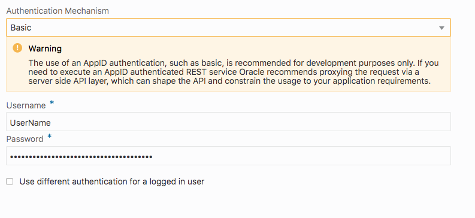
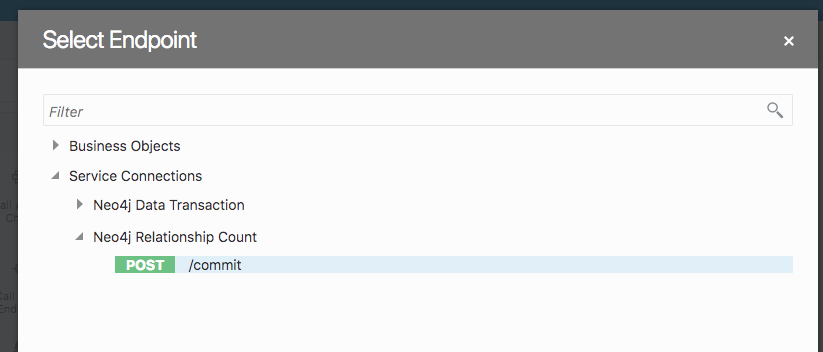
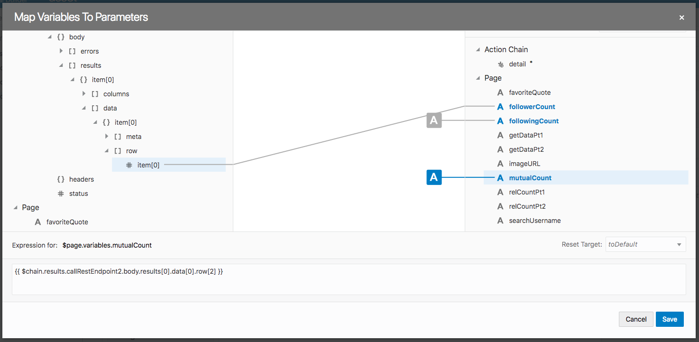

## Next part idk

Now we want to be able to return a) the count of followers/following/mutuals and b) the list of followers/following/mutuals. <br>
Let's start with the count. We're going to have to make another Service Connection, even though we are using the same URL, because our request and response bodies will be formatted differently. Make a new Service Connection, copy and paste your Database REST endpoint URL /transaction/commit into the URL, set method to POST, and hit next. <br>
<br>
Name it Neo4j Relations Count and set up Authentication the same way as before. <br>
  
<br>
As mentioned, our request will be a bit different:
```
{
  "statements" : [ {
    "statement" : "MATCH (user:Person {name:'YukiTsukino'}) RETURN size((user)-->()) as out, size((user)<--()) as in"
  } ]
}
```
You can see that the Cypher statement is returning three things: ingoing relationships (followers of user), outgoing relationships (people who the user is following), and people who the the user follows, that also follow the user (mutual follow).<br>
<br>
Go to Test and hit Send. The response should look like this:
```
{
    "results": [
        {
            "columns": [
                "out",
                "in"
            ],
            "data": [
                {
                    "row": [
                        4,
                        2
                    ],
                    "meta": [
                        null,
                        null
                    ]
                }
            ]
        }
    ],
    "errors": []
}
```
Finally, hit Copy to Response Body, and you're done with the connection.<br>
 
<br>

# Break

Now we will add another two variables to our page `relCountPt1` and `relCountPt2`. <br>
relCountPt1: `{  "statements": [   {    "statement": "MATCH (user:Person {name: '`<br>
relCountPt2: `'}) RETURN size((user)<--()) as in, size((user)-->()) as out, size((user)-->()-->(user)) as mutuals"   }  ] } `<br>
Again, searchUsername will go in the middle. <br>
Go to our ButtonClickAction, and drag and drop a Call REST Endpoint action. Choose the `Neo4j Realtionship Count` connection we just made.<br>
 
<br>
Body:<br>
 
<br>
Drag and drop an Assign Variables action. <br>
Assign followerCount with a simple drag and drop like so:<br>
 
<br> 
However, you'll notice it only lists the first element in the returned row. For followingCount and mutualCount, we need the second and third elements respectively. Go ahead and drag `item[0]` over to following count, but change the `row[0]` to be `row[1]`. <br>
 
<br> 
Do the same thing for mutualCount, but this time chaging `row[0]` to be `row[2]`. <br>
 
<br> 
Test your webpage: it should be working!<br>
 
<br> 
